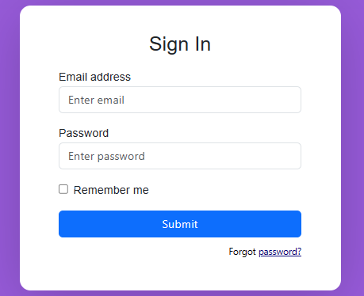
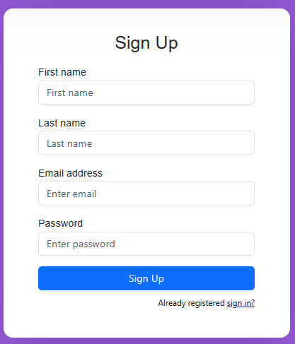

<h2 align="center">Simple Login & Registration UI Template using React - Bootstrap 5</h2>
An example of React login system project with basic user functionality.


# Screenshoots
| Log In | Create an account |
| -------|--------------|
|  |  | 


## Why does this repository exist?
Many beginners with basic knowledge are not sure how to start their portfolios; and with this project we want to encourage them to build something that can be applied to future projects, in this case a first part just the front end but that in the future can be coupled in a backend with a connection for example with DB No SQL such as MongoDB


## Requirements
- You must have basic knowledge of HTML, CSS, React, JavaScript, TypeScript, and a little bit of ES6. 
- Make sure you must have [Node](https://nodejs.org/pt-br) set up in your machine, check out this tutorial on setting up Node.

  

   ### 🚀Clone the project
  ```bash
  https://github.com/DaveSimoes/login-signup-react-bootstrap.git
   ```
   ```bash
  cd login-signup-ui
   ```
  


  ## 🛠 Installation and Setup Instructions /Instruções para instalação.
  
  1. Installation: `npm install`

  2. In the project directory, you can run: `npm start`
     

 ## License

Licensed under [MIT](http://www.opensource.org/licenses/mit-license.php). You can use this script for free for any
private or commercial projects.

## Contribute

Please create a feature-branch if possible when committing to the project, if not then simply commit to master branch.

